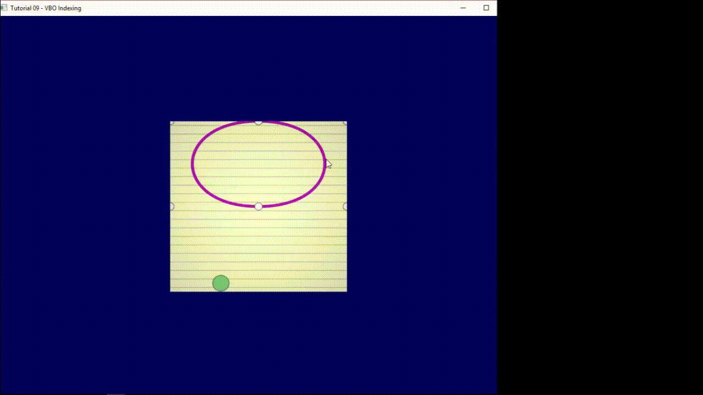
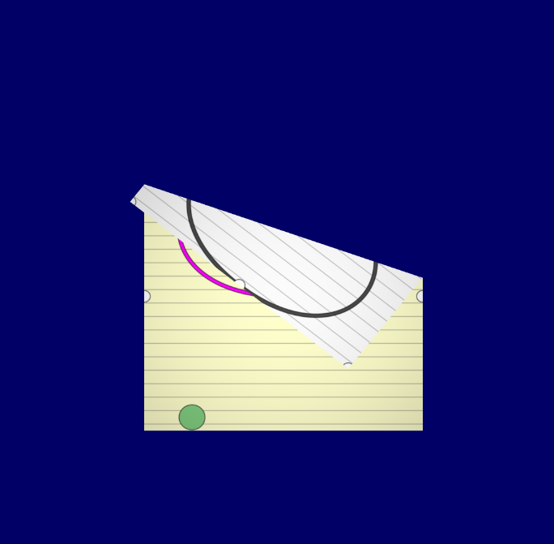

# Folded
Folded is a puzzle vague puzzle game idea that I've not yet refined it enough to be able to produce interesting puzzles

Here's an old gif of the main mechanic, ie folding paper.

Here's a newer one where I've started to add some placeholder entities, collisions using gjk and epa and a simple bezier curve editor to make levels. After playing around with this and not finding any good puzzles in there I've decided to put this project on the shelf.

It runs smoothly (at ~90fps), I'm just not very good at producing high quality gifs.

Here is a screenshot that isn't super downsampled.

